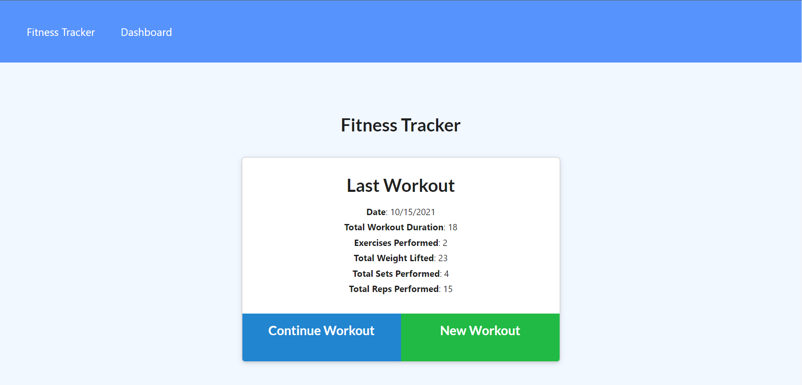

# Fitness Tracker

[See the site in action!](https://fitness-tracker-wijeremy.herokuapp.com/?id=6169f2bc5a3a4f350c7f689c)

## Description

I built this project to practice using Mongoose and routing mongoose requests through express.
This app can track your workout routine and displays workout totals in a convenient graph.
I learned a lot about routing and mongoose. It helped me hone my databse skills and opened my eyes to new and interesting ways to handle a database. I first over thought my project and wanted to link workouts and exercises that would exist seperately. While that might be good for bigger and more complex databases, keeping exercises as an array that lived inside workouts turned out to be much easier for this smaller application.

## Table of Contents

- [Installation](#installation)
- [Usage](#usage)
- [License](#license)
- [Contributing](#contributing)
- [Tests](#tests)
- [Questions](#questions)

## Installation

Run npm install. I would add an env file with your mongo atlas information, but you could also uncomment the local host routing in server to handle everything locally.

## Usage

Add or extend a workout with either button. Adding a workout creates a new workout that will be tracked. Then fill out the exercise information as instructed.

## License

I am using [MIT](https://opensource.org/licenses/MIT) to license this app.

## Contributing

See license.

## Tests

No tests.

## Questions?

Email me at jeremydavwilliams@gmail.com or visit [my github page](github.com/wijeremy)
